# 反射

> 作者：子墨同学 
>
> 时间：2020-04-03 

[TOC]


## Java Reflection

1. Reflection(反射)是Java被视为动态语言的关键，反射机制允许程序在执行期借助于Reflection API获取任何类的内部信息，并能直接操作任意对象的内部属性及方法。

```java
   Class clazz = Class.forName("java.lang.String");
```

2. 加载完类之后，在**堆内存**的方法区中就产生了一个Class类型的对象（**一个类只有一个Class对象**），这个对象就包含了完整的类的结构信息。我们可以通过这个对象看到类的结构。这个对象就像一面镜子，通过这个镜子看到类的结构，所以，我们形象的称之为：**反射**。


## Java反射机制研究及应用

1. Java反射机制提供的功能

   - 在运行时判断任意一个对象所属的类

   - 在运行时判断任意一个类的对象

   - 在运行时判断任意一个类所具有的成员变量和方法

   - 在运行时获取泛型信息

   - 在运行时调用任意一个对象的成员变量和方法

   - 在运行时处理注解

   - 生成动态代理


## Java反射的优点和缺点

1. 优点：
   - 可以实现动态创建对象和编译，体现出很大的灵活性
2. 缺点
   - 对性能有影响。使用反射基本上是一种解释操作，我们可以告诉JVM，我们希望做什么并且它满足我们的要求。这类操作慢于直接执行相同的操作。

## 反射相关的API

- java.lang.Class：代表一个类
- java.lang.reflect.Method：代表类的方法
- java.lang.reflect.Field：代表类的成员变量
- java.lang.reflect.Constructor：代表类的构造器
- ..........

### Class类

在`Object`类中定义了以下的方法，此方法将被所有子类继承：

```java
public final Class getClass()
```

以上的方法返回值的类型是一个Class类，此类是Java反射的源头，实际上所谓反射从程序的运行结果来看也很好理解，即：**可以通过对象反射求出类的名称。**

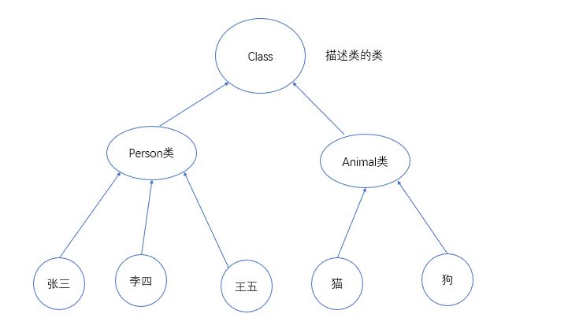


对象照镜子后可以得到的信息：某个类的属性、方法和构造器、某个类到底实现了哪些接口。对于每个类而言，JRE都为其保留了一个不变的Class类型的对象。一个Class对象包含了特定某个结构（class/interface/annotation/primitive type/void/[]）的有关信息。

- Class本身也是一个类
- Class对象只能由西戎建立对象
- 一个加载的类在JVM中只会有一个Class实例
- 一个Class对象对应的是一个加载到JVM中的.class文件
- 每个类的实例都会记得自己是由哪一个Class实例所生成
- 通过Class可以完整地得到一个中所有的被加载的结构
- Class类时Reflection的根源，针对任何你想动态加载、运行的类，唯有先获取响应的Class对象

### Class类的常用方法

| 方法名                                          | 功能说明                                                  |
| ----------------------------------------------- | --------------------------------------------------------- |
| public static Class<?> forName(String name)     | 返回指定类名name的Class对象                               |
| public T newInstance()                          | 调用空参构造函数，返回Class对象的一个实例                 |
| public String getName()                         | 返回Class对象所表示的实体（类、接口、数组类或void）的名称 |
| public native Class<? super T> getSuperclass(); | 返回当前Class对象的父类Class对象                          |
| public Class<?>[] getInterfaces()               | 获取当前Class对象的接口                                   |
| public ClassLoader getClassLoader()             | 返回该类的类加载器                                        |


### 获取Class类的实例

1. 若已知具体的**类**，通过类的class属性获取，**该方法最为安全可靠，程序性能最高**。

   ```java
   Class clazz = Person.class;
   ```

2. 已知某个类的**实例**，调用该实例的getClass()方法获取Class对象；

   ```java
   Class clazz = person.getClass();
   ```

3. 已知一个类的**全类名**，且该类在类路径在，可以通过Class类的静态方法forName()获取；

   ```java
   Class clazz = Class.forName("java.lang.String");
   ```

4. 内置基本类型可以直接用 `类名.TYPE`获取

   ```java
    Class<Integer> clazz = Integer.TYPE;
   ```

5. 利用ClassLoader获取

### 哪些类型可以有Class对象

- class：外部类、成员（成员内部类、静态内部类），局部内部类、匿名内部类
- interface：接口
- []：数组
- enum：枚举
- annotation：注解@interface
- primitive type：基本数据类型
- void

### Java内存分析


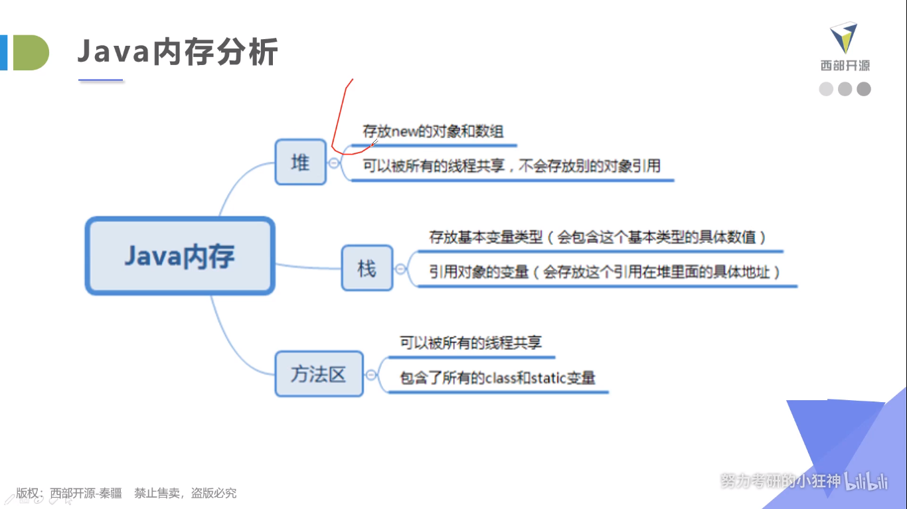


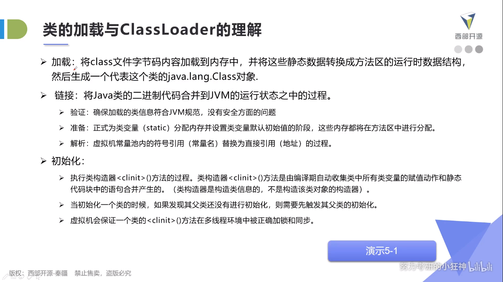


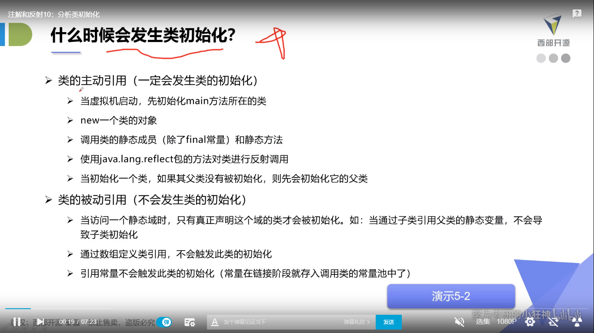


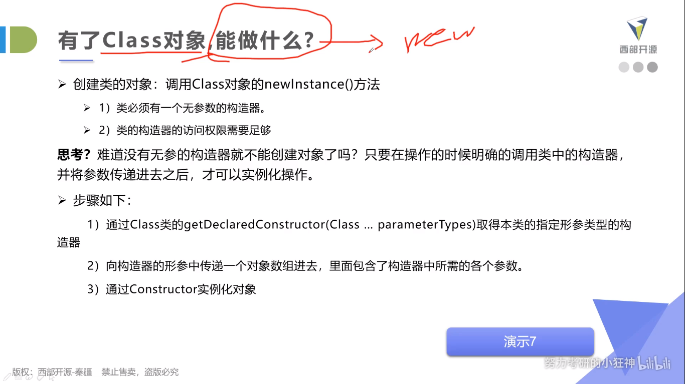


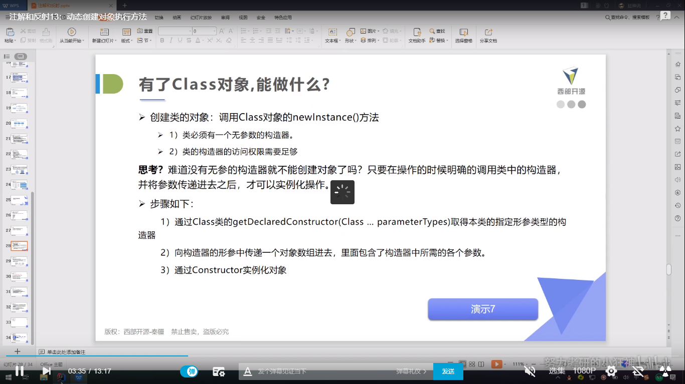


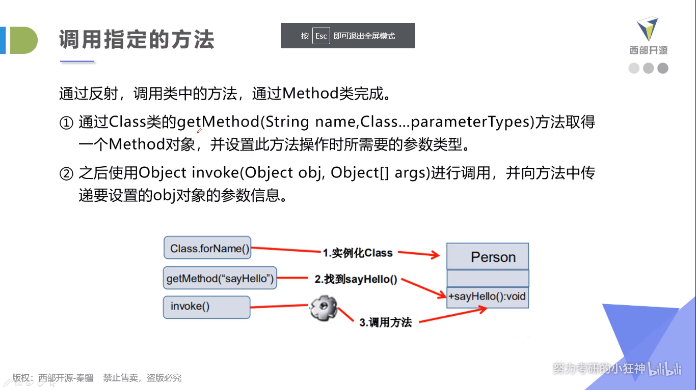

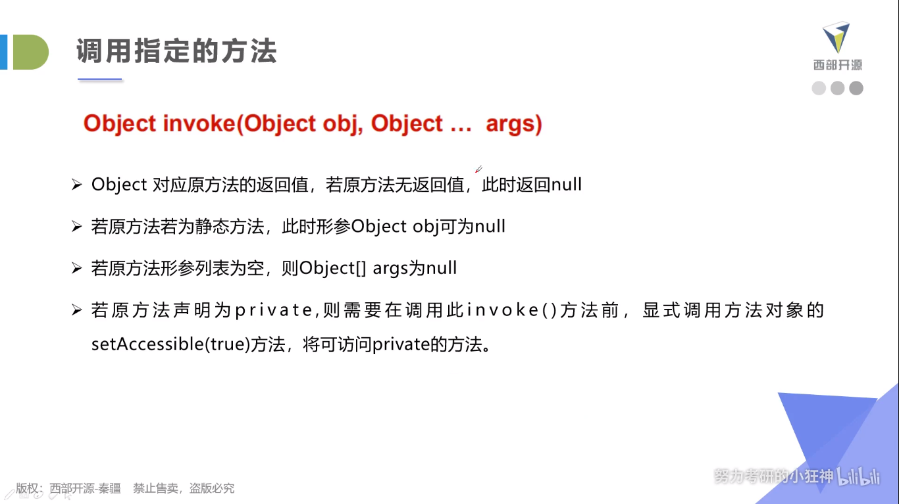

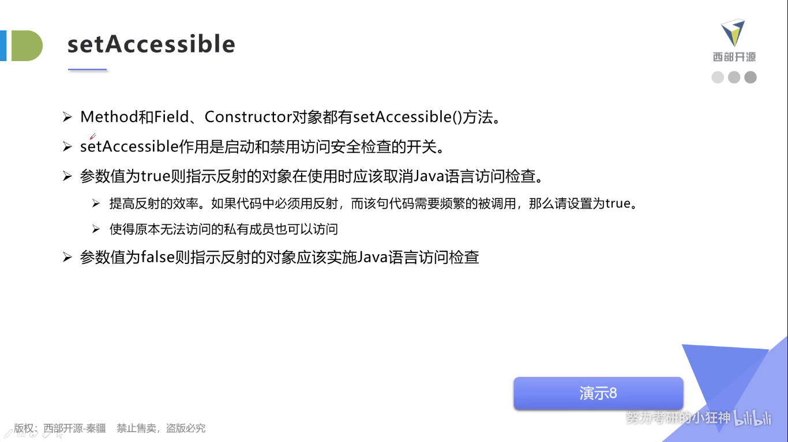


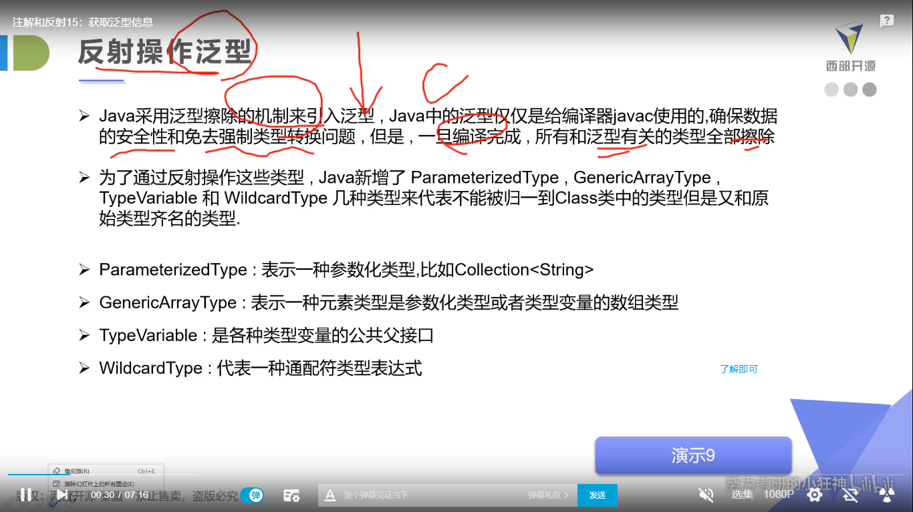


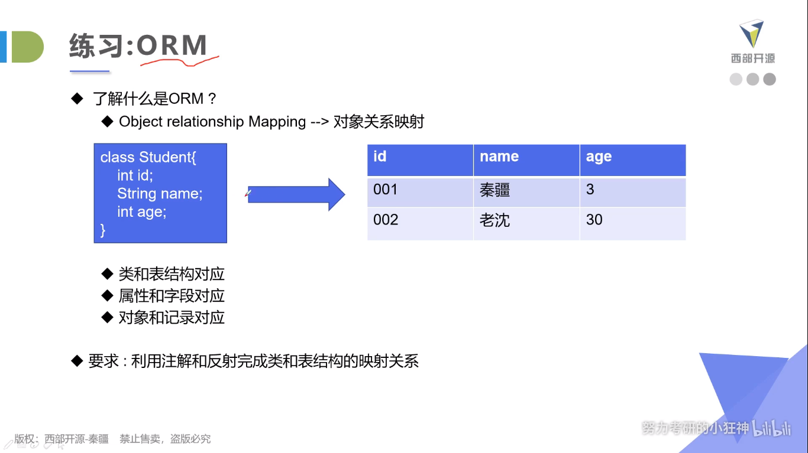

## 参考资料

