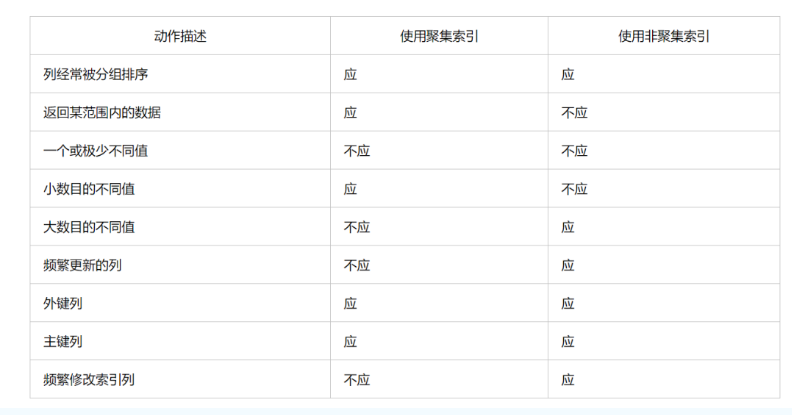

# MySQL数据库经典面试题解析

## 数据库

### 1. MySQL索引使用的注意事项

可以从三个维度回答这个问题：**索引哪些情况会失效**，**索引不适合哪些场景**，**索引规则**

**索引哪些情况会失效**

- 查询条件包含or，可能导致索引失效
- 如果字段类型是字符串，where时一定用引号`‘’`括起来，否则索引失效
- like通配符**可能**导致索引失效【%开头】。
- 联合索引，查询时的条件列不是联合索引中的第一个列，索引失效。
- 在索引列上使用mysql的内置函数，索引失效。
- 对索引列运算（如，+、-、*、/），索引失效。
- 索引字段上使用（！= 或者 < >，not in）时，可能会导致索引失效。
- 索引字段上使用is null， is not null，**可能**导致索引失效。
- <u>左连接查询或者右连接查询查询关联的字段编码格式不一样，可能导致索引失效</u>。
- mysql估计使用全表扫描要比使用索引快,则不使用索引。

[后端程序员必备：索引失效的十大杂症](https://mp.weixin.qq.com/s/AsfRjsmp3unc941BRS_4zw)

**索引不适合哪些场景**

- 数据量少的不适合加索引
- 更新比较频繁的也不适合加索引
- 区分度低的字段不适合加索引（如性别）

**索引的一些潜规则**

- 覆盖索引
- 回表
- 索引数据结构（B+树）
- 最左前缀原则
- 索引下推

### 2. MySQL遇到过死锁问题如何解决

步骤：

- 查看死锁日志show engine innodb status;
- 找出死锁Sql
- 分析sql加锁情况
- 模拟死锁案发
- 分析死锁日志
- 分析死锁结果

可以看我这两篇文章哈：

- [手把手教你分析Mysql死锁问题](http://mp.weixin.qq.com/s?__biz=MzIwOTE2MzU4NA==&mid=2247483983&idx=1&sn=88bad91b6058c5fc40d346c0d71428c5&chksm=97794660a00ecf762978d9ebbc390d61de619ba22701f33720e3b95e5edf137e56a18ce5be46&scene=21#wechat_redirect)
- [Mysql死锁如何排查：insert on duplicate死锁一次排查分析过程](http://mp.weixin.qq.com/s?__biz=MzIwOTE2MzU4NA==&mid=2247483716&idx=1&sn=5bc2f65b14e7912cfbbba23016cb033d&chksm=9779456ba00ecc7dd840aea135008c46f88ec6da2586c09f77b85a5c4e20287f9ee8cfb31295&scene=21#wechat_redirect)


### 3. 日常工作中怎么优化SQL

- 加索引
- 避免返回不必要的数据
- 适当分批量进行
- 优化sql结构
- 分库分表
- 读写分离

### 4. 说说分库与分表的设计

分库分表方案，分库分表中间件，分库分表可能遇到的问题

**分库分表方案:**

- 水平分库：以字段为依据，按照一定策略（hash、range等），将一个库中的数据拆分到多个库中。
- 水平分表：以字段为依据，按照一定策略（hash、range等），将一个表中的数据拆分到多个表中。
- 垂直分库：以表为依据，按照业务归属不同，将不同的表拆分到不同的库中。
- 垂直分表：以字段为依据，按照字段的活跃性，将表中字段拆到不同的表（主表和扩展表）中。

**常用的分库分表中间件：**

- sharding-jdbc（当当）
- Mycat
- TDDL（淘宝）
- Oceanus(58同城数据库中间件)
- vitess（谷歌开发的数据库中间件）
- Atlas(Qihoo 360)

**分库分表可能遇到的问题**

- 事务问题：需要用分布式事务啦
- 跨节点Join的问题：解决这一问题可以分两次查询实现
- 跨节点的count,order by,group by以及聚合函数问题：分别在各个节点上得到结果后在应用程序端进行合并。
- 数据迁移，容量规划，扩容等问题
- ID问题：数据库被切分后，不能再依赖数据库自身的主键生成机制啦，最简单可以考虑UUID
- 跨分片的排序分页问题（后台加大pagesize处理？）

### 5. InnoDB与MyISAM的区别

- InnoDB支持事务，MyISAM不支持事务
- InnoDB支持外键，MyISAM不支持外键
- InnoDB 支持 MVCC(多版本并发控制)，MyISAM 不支持
- select count(*) from table时，MyISAM更快，因为它有一个变量保存了整个表的总行数，可以直接读取，InnoDB就需要全表扫描。
- Innodb不支持全文索引，而MyISAM支持全文索引（5.7以后的InnoDB也支持全文索引）
- InnoDB支持表、行级锁，而MyISAM支持表级锁。
- InnoDB表必须有主键，而MyISAM可以没有主键
- Innodb表需要更多的内存和存储，而MyISAM可被压缩，存储空间较小，。
- Innodb按主键大小有序插入，MyISAM记录插入顺序是，按记录插入顺序保存。
- InnoDB 存储引擎提供了具有提交、回滚、崩溃恢复能力的事务安全，与 MyISAM 比 InnoDB 写的效率差一些，并且会占用更多的磁盘空间以保留数据和索引

### 6. 数据库索引的原理，为什么要用B+树，为什么不用二叉树

可以从几个维度去看这个问题，查询是否够快，效率是否稳定，存储数据多少，以及查找磁盘次数，为什么不是二叉树，为什么不是平衡二叉树，为什么不是B树，而偏偏是B+树呢？

**为什么不是一般二叉树？**

如果二叉树特殊化为一个链表，相当于全表扫描。平衡二叉树相比于二叉查找树来说，查找效率更稳定，总体的查找速度也更快。

**为什么不是平衡二叉树呢？**

我们知道，在内存比在磁盘的数据，查询效率快得多。如果树这种数据结构作为索引，那我们每查找一次数据就需要从磁盘中读取一个节点，也就是我们说的一个磁盘块，但是平衡二叉树可是每个节点只存储一个键值和数据的，如果是B树，可以存储更多的节点数据，树的高度也会降低，因此读取磁盘的次数就降下来啦，查询效率就快啦。

**那为什么不是B树而是B+树呢？**

1）B+树非叶子节点上是不存储数据的，仅存储键值，而B树节点中不仅存储键值，也会存储数据。innodb中页的默认大小是16KB，如果不存储数据，那么就会存储更多的键值，相应的树的阶数（节点的子节点树）就会更大，树就会更矮更胖，如此一来我们查找数据进行磁盘的IO次数有会再次减少，数据查询的效率也会更快。

2）B+树索引的所有数据均存储在叶子节点，而且数据是按照顺序排列的，链表连着的。那么B+树使得范围查找，排序查找，分组查找以及去重查找变得异常简单。

可以看这篇文章哈：[再有人问你为什么MySQL用B+树做索引，就把这篇文章发给她](http://mp.weixin.qq.com/s?__biz=MzIwOTE2MzU4NA==&mid=2247484085&idx=1&sn=92639430ac7ef3e412b550a09bde0115&chksm=9779469aa00ecf8c157e899fe0d5c5b060b282a4e5f2f2f63c187eb3c04d04ef6fad7a1e09e3&scene=21#wechat_redirect)

### 7. 聚集索引与非聚集索引的区别

- 一个表中只能拥有一个聚集索引，而非聚集索引一个表可以存在多个。
- 聚集索引，索引中键值的逻辑顺序决定了表中相应行的物理顺序；非聚集索引，索引中索引的逻辑顺序与磁盘上行的物理存储顺序不同。
- 索引是通过二叉树的数据结构来描述的，我们可以这么理解聚簇索引：索引的叶节点就是数据节点。而非聚簇索引的叶节点仍然是索引节点，只不过有一个指针指向对应的数据块。
- 聚集索引：物理存储按照索引排序；非聚集索引：物理存储不按照索引排序；

**何时使用聚集索引或非聚集索引？**




### 8. limit 1000000加载很慢的话，怎么解决

**方案一：**如果id是连续的，可以这样，返回上次查询的最大记录(偏移量)，再往下limit

```sql
select id，name from employee where id>1000000 limit 10.
```

**方案二：**在业务允许的情况下限制页数

建议跟业务讨论，有没有必要查这么后的分页啦。因为绝大多数用户都不会往后翻太多页。

**方案三：**order by + 索引（id为索引）

```sql
select id，name from employee order by id  limit 1000000，10
```

**方案四：**利用延迟关联或者子查询优化超多分页场景。（先快速定位需要获取的id段，然后再关联）

```sql
SELECT a.* FROM employee a, (select id from employee where 条件 LIMIT 1000000,10 ) b where a.id=b.id
```

### 9. 如何选择合适的分布式主键方案

- 数据库自增长序列或字段
- UUID
- Redis生成ID
- Twitter的snowflake算法
- 利用zookeeper生成唯一ID
- MongoDB的ObjectId

### 10. 事务的隔离级别有哪些？MySQL的默认隔离级别是什么？

- 读未提交（Read Uncommitted）
- 读已提交（Read Committed）
- 可重复读（Repeatable Read）
- 串行化（Serializable）

Mysql默认的事务隔离级别是可重复读(Repeatable Read)

可以看我这篇文章哈：[一文彻底读懂MySQL事务的四大隔离级别](http://mp.weixin.qq.com/s?__biz=MzIwOTE2MzU4NA==&mid=2247483967&idx=1&sn=bf96b462b1e475d7acb95eaa9c26c575&chksm=97794610a00ecf068bfaaecec5a65ca31fafc915b1571d337ea59686f41ffed4d8acbc1d41a2&scene=21#wechat_redirect)

## 参考资料

1. [https://mp.weixin.qq.com/s/R9L9My_mwYd7o0Aj5foa5A](https://mp.weixin.qq.com/s/R9L9My_mwYd7o0Aj5foa5A)